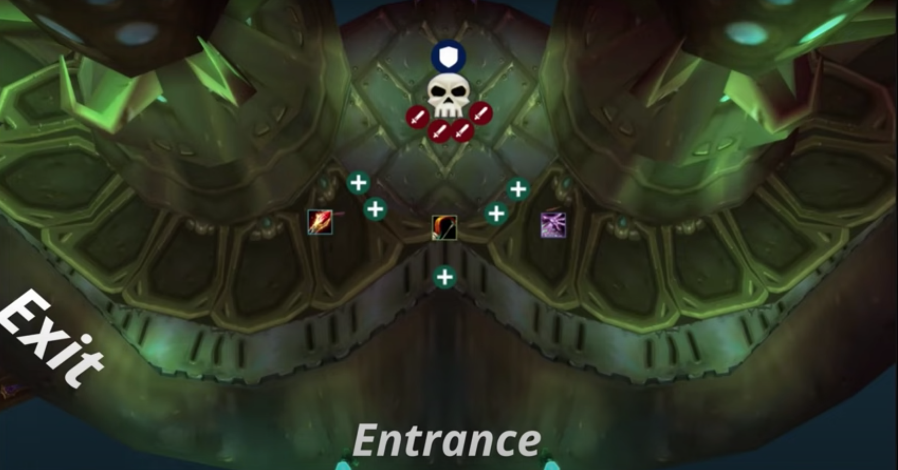
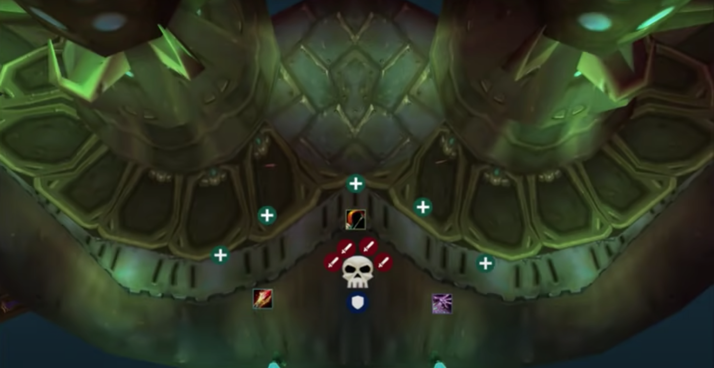
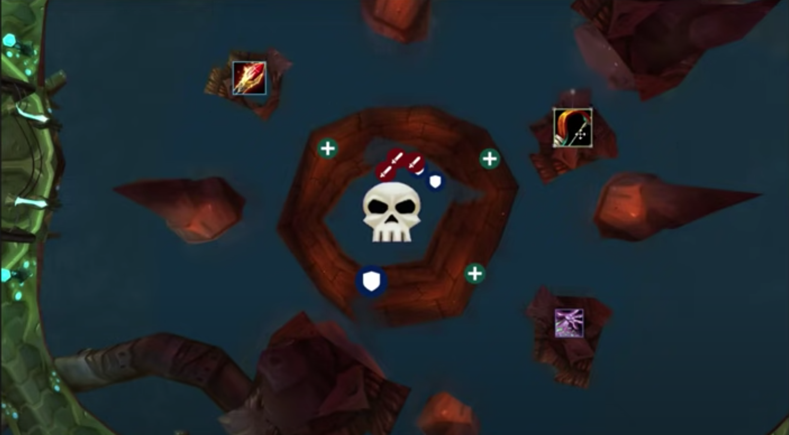
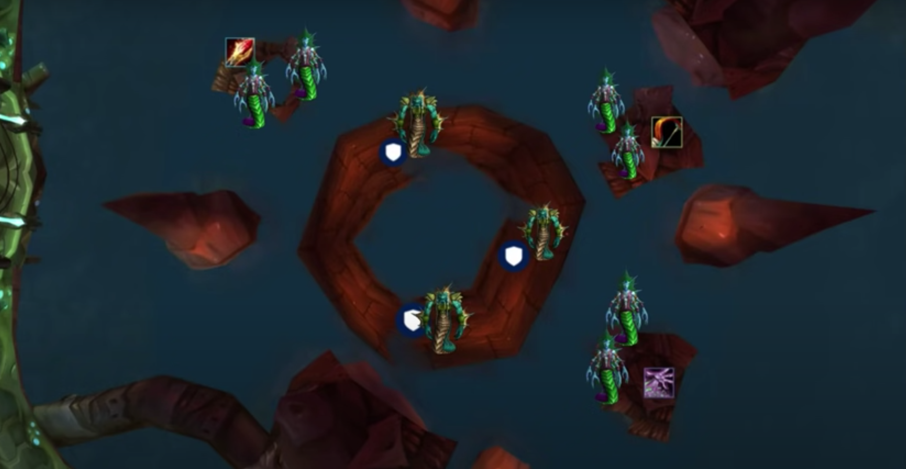
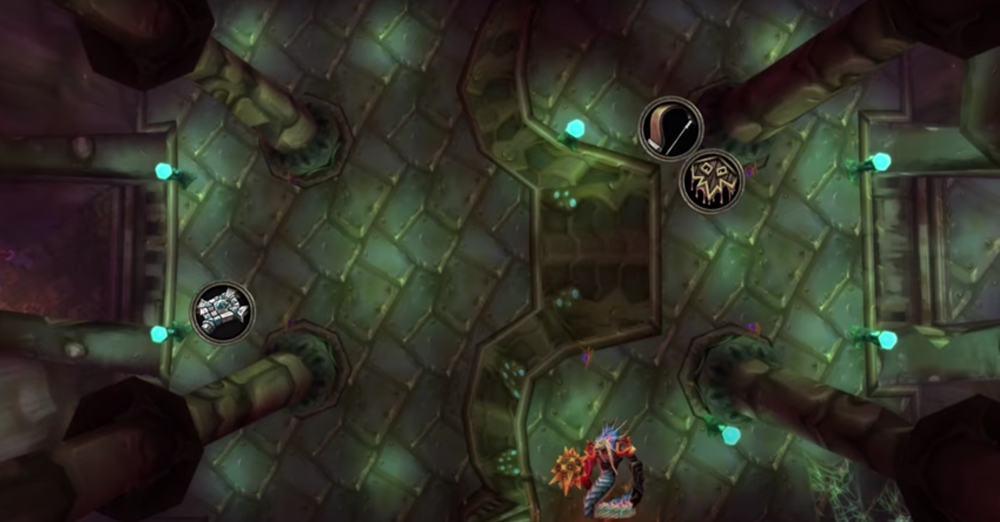
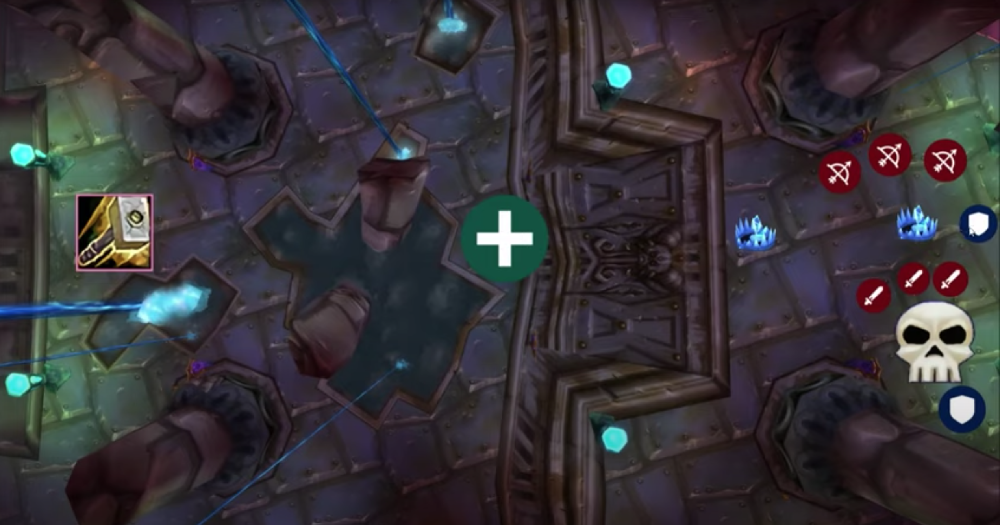
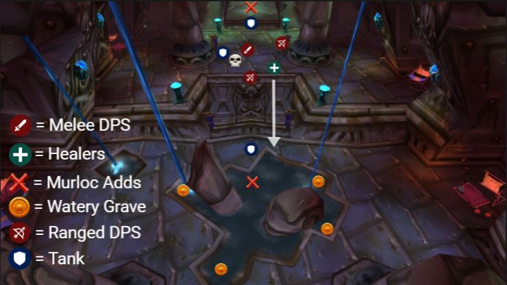

# Bloodbaine and **you** in phase two
---

A quick note to start with: during progression we will try to stick to our 3 hour schedules. We will progress with a focused mindset, but ultimately we are here to have fun as a team. Enjoy these new and exciting raids we are about to face.

Besides that, this document is in case you are new to SSC and you want a good idea of what you are getting in to. If you have a good idea of what is going on and just want a quick view of the assignments [**here**](ASSIGNMENTS.md) you go.

## Group setup

Before each raid, the table below will be updated to reflect the group composition of that day. I will use strictly character names so new guild members aren't left in the dark. Each entry in the table receives a number which will be used for assignments. This is to increase reusability of the sheet and to avoid confusion.

| Tanks | Healers | Melee | Ranged |
| ----------- | ----------- | ----------- | ----------- |
| T1: Tomorrowland   | 4: Raemar         | 9: Djretmasterx   | H1: Nazzo |
| T2: Lieven         | 5: Naarii         | 10: Zyepox        | H2: Hayfa |
| T3: Khyrdan        | 6: Talyra         | 11: Kritzo        | H3: Dragma |
|                   | 7: Adeptus        | 12: Snowbolls     | 14: Lepotan |
|                   | 8: Eiswuerfel     | 13: Shamidon      | M1: Capernian |
|                   |                   |                   | M2: Ex |
|                   |                   |                   | WL1: Marionette |
|                   |                   |                   | WL2: Onlytwogendr |
|                   |                   |                   | WL3: Galing |
|                   |                   |                   | WL4: Brunarian |
|                   |                   |                   | 15: Agaboo |
|                   |                   |                   | 16: Samlad |

## Serpentshrine Cavern
---

### Trash leading up to **Hydross the Unstable**

Before we can beat the mighty first boss of SSC, we need to clear trash. This trash does require some paying attention to. There are a few types of packs before the first boss.

**FIRST TYPE OF PACK**

[**Coilfang Hate-Screamer**](https://tbc.wowhead.com/npc=21339/coilfang-hate-screamer)
- Immune to CC
- AOE silence 30 yards around herself
- Arcane blasts nearby enemies
- Moderate melee damage

[**Serpentshrine Sporebat**](https://tbc.wowhead.com/npc=21246/serpentshrine-sporebat)
- Vulnerable to CC
- Charges furthest target for moderate melee damage
- Coilfang Beast-Tamers can enrage them, making them immune to CC

[**Serpentshrine Beast-Tamer**](https://tbc.wowhead.com/npc=21221/coilfang-beast-tamer)
- Immune to CC
- Cleaves
- Can enrage Serpentshrine Sporebats, making them immune to CC

> Kill Beast-Tamers >> CC Sporebats >> Kill Hate-Screamers >> Kill Sporebats

**SECOND TYPE OF PACK**

[**Underbog Colossus**](https://tbc.wowhead.com/npc=21221/coilfang-beast-tamer)

These are like the father of the ones in Steamvaults. Nature resistance helps a lot on these. They are also similar to the Anubisath Sentinels or the Core Hounds. They spawn with random abilities that are unique to them.

- *Type A*: does a [**Spore Quake**](https://tbc.wowhead.com/spell=38976/spore-quake). Shit's nasty. 2,000 damage per tick and a chance to knock down. Melee need to get to at least 30 yards away.
- *Type B*: 
    - does an [**Acid Geyser**](https://tbc.wowhead.com/spell=41573/acid-geyser). Works exactly the same as the Netherspite breath. Everyone needs to spread out.
    - Affects players with a DOT which afterwards spawns a little parasite. Kill it, or it reinfects other players.
- *Type C*: these enrage. Hunters need to [**Tranquilizing Shot**](https://tbc.wowhead.com/spell=19801/tranquilizing-shot)

They also have abilities when they die. Notably they can either spawn a load of adds or two big ones. The other abilities I'm sure will speak for themselves. Goblins can herb these giants for a nice profit. [**hehe**](https://external-content.duckduckgo.com/iu/?u=http%3A%2F%2Fcustom-gwent.com%2FcardsBg%2F57086c5f7494678b06d3098c4502ca35.jpeg&f=1&nofb=1)

### **Hydross the Unstable**: "The melee killer"

The fight is split up in two phases. A **Frost** and a **Nature** phase. We will have to manually move the boss from phase to phase to prevent us dying to the **Mark** mechanic. When the boss is moved across the middle he changes to an according phase. **North is the Frost** phase and **South is the Nature** phase. This also triggers a **THREAT WIPE**, which means no damage is supposed to go out during the transition.

The **Mark** mechanic is a specific debuff for either phase that stacks up slowly the longer you are in a phase. This makes it harder to stay in a given phase. We will **swap to either side around 100% of the Mark debuff**.

Below you can find the positioning for the **Frost** phase.



During the **Frost** phase, the boss targets players with [**Water Tomb**](https://tbc.wowhead.com/spell=38235/water-tomb), an AOE stun which deals moderate DOT damage. Everyone needs to be at least 8 yards apart.

Below you can find the positioning for the **Nature** phase.



During the **Nature** phase, the boss puts a [**Vile Sludge**](https://tbc.wowhead.com/spell=38246/vile-sludge) debuff on a random player, reducing their healing taken and doing moderate DOT damage.

Adds will spawn during the **phase transitions** around Hydross. The **third tank (Khyrdan)** is responsible for picking these up. If the tank is overwhelmed, **Warlocks** can help by **Banishing** escaped adds.

### Trash leading up to **The Lurker Below**

This trash is a joke. You can read up on them if you are so inclined. I made all the names clickable. Kill order as follows.

> CC [Greyheart Technicians](https://wowpedia.fandom.com/wiki/Greyheart_Technician) and [Coilfang Priestesses](https://wowpedia.fandom.com/wiki/Coilfang_Priestess) >> Kill [Coilfang Shatterers](https://wowpedia.fandom.com/wiki/Coilfang_Shatterer) >> Kill [Vashj'ir Honor Guard](https://wowpedia.fandom.com/wiki/Vashj%27ir_Honor_Guard) >> Kill [Greyheart Technicians](https://wowpedia.fandom.com/wiki/Greyheart_Technician)

### **The Lurker Below**: Loot Piñata

Any improved [King's Defenderers](https://tbc.wowhead.com/item=30058/mallet-of-the-tides)? First week for sure. This guy is just like Chess Event, in that he will never drop what you want and will bore you to tears.

He swaps between **two phases**. A **Boss** phase and an **Add** phase. 

Below, you can see the positioning for the **Boss** phase.



He does three things in the **Boss** phase. 

- He does a [**Geyser**](https://tbc.wowhead.com/spell=37478/geyser), which acts similar to the [**Water Tomb**](https://tbc.wowhead.com/spell=38235/water-tomb) from **Hydross**. Everyone needs to be 10 yards apart ideally.
- He will straight up [**go Blastoise mode**](https://external-content.duckduckgo.com/iu/?u=https%3A%2F%2Forig00.deviantart.net%2F63e8%2Ff%2F2013%2F104%2F2%2Fc%2Fblastoise_by_youngj723-d61rt01.jpg&f=1&nofb=1) and start squirting water clockwise or counter clockwise (like **C'thun**). You will keep pumping until he's about to turn to you, at which point you jump in the water for safety. ([wowhead link](https://tbc.wowhead.com/spell=37433/spout))
- He does a [**Whirl**](https://tbc.wowhead.com/spell=37363/whirl) which is a melee only mechanic. Tanks will take care of this with a gap closer so no unfortunate accidents happen.

After two minutes **The Lurker Below** will submerge, starting the **Add** phase.



During this **Add** phase, **adds** spawn (who would've thought). Each small platform spawns two [**Coilfang Ambushers**](https://tbc.wowhead.com/npc=21865/coilfang-ambusher). These **will be CC'ed by the ranged DPS on the platform** until the [**Coilfang Guardians**](https://tbc.wowhead.com/npc=21873/coilfang-guardian) (**these cleave**) are dead. These Guardians will be tanked and focused down, after which melee and casters will go around in a clockwise fashion to kill the Ambushers. 

After the **adds** are dead, **The Lurker Below** will reemerge and do a wombocombo, so prepare for that.

> Whirl >> Spout >> Whirl

After this it's rinse and repeat boys and girls. Time to collect that mace.

### Leotheras the Blind

The fight starts with three adds which will be killed in any order. After this **Leotheras** will come out. booba. Leotheras will swap between his **human** and **demon** phase. He starts out in his **human** phase.

In the **human** phase, he will periodically cast [Whirlwind](https://tbc.wowhead.com/spell=37641/whirlwind) while moving to random players. You **NEED** to avoid this. Spread out and run like you did on [Battleguard Sartura](https://classic.wowhead.com/npc=15516/battleguard-sartura). **After each [Whirlwind](https://tbc.wowhead.com/spell=37641/whirlwind) he RESETS THREAT.** So you need to **wait** until the tank establishes threat.

**After 45 seconds**, Leotheras transitions to his **demon** phase and this is where a warlock with fire resistance will pick him up. When picked up the warlock just needs to maintain threat and be healed. That's it.

Leotheras will sometimes spawn a **inner demon** on up to five players. **These need to be killed by the person afflicted by the inner demon.** No one can help you. If you cannot finish it before the **demon** phase ends, you will get **mind controlled**. Most likely resulting in a wipe.

At 15% he duplicates himself, meaning we are fighting both phases at the same time. The warlock picks up the demon and the human is finished off quickly.

### Phantom-Lord Karathress

This guy, again, is piss easy. Diagram for positioning below.



Kill order is:

> Shaman >> Hunter >> Priest >> Phantom-Lord Karathress

**PHANTOM-LORD GAINS ABILITIES FROM ADDS THAT DIE, JUST LIKE OPENING TRASH IN AQ40.**

The **Shaman and Hunter** will be cleaved together. The **Shaman** will spawn [Spitfire Totems](https://tbc.wowhead.com/spell=38236/spitfire-totem) which have to be killed. The **Hunter** spawns an add which has to be picked up and cleaved down. 

The **Priest** will be pulled off to the side behind a pillar and tanked together with a healer.

When the **Shaman** dies, **Phantom-Lord** is brought to the **Shaman's** spot and will start to get cleaved. **AT NO POINT CAN PHANTOM-LORD'S HEALTH BE BELOW 75% WHEN THERE ARE STILL ADDS UP.** This will cause a wipe.

When the **Hunter** dies, we kill the **Priest** while interrupting her. After which we nuke the **Phantom-Lord**.

### Morogrim Tidewalker

Morogrim might be a bit of a challenge organisation wise. Positionings below.





**Phase One**

During Phase One, we will move Tidewalker to a pillar while facing him away from the raid. This is to prevent Tidal Wave from hitting anyone other than the tank. Here, the raid should be positioned behind Tidewalker, where they can both kill the boss and efficiently AOE down any Murloc waves that come.

Phase One lasts until Earthquake is cast, at which point two Murloc Waves will be summoned and begin racing toward Tidewalker's room. At this point Hunters will put down Frost Traps to slow down the incoming Murlocs.

**Phase Two**

Dealing with the Murlocs is the most difficult part of this encounter. You will need to give plenty of time to generate threat before using AOE abilities to burn the groups down. 

Once the Murloc wave is cleared, the group can go back to hitting Tidewalker, just as they did in Phase One.

**Phase Three**

Once Tidewalker reaches 25% total health, Tidewalker will cast **Summon Water Globule**, which summons Water Globules that move slowly and fixate toward a random target. To deal with this, we will move Tidewalker into the corner of the room, away from the Globules.

### Lady Vashj

First of all, you need this macro:

```
/use Tainted Core
/y <------- TAINTED CORE TO: %t !!!
/s <------- TAINTED CORE TO: %t !!!
/script SendChatMessage("!!! YOU HAVE THE CORE !!!", "WHISPER", nil, UnitName("target"));
```

Lady Vashj will probably be the most challenging boss in SSC for us. That being said, this boss consists of three phases. I will explain each phase thoroughly. 

**Phase One** 

It's just us and Lady Vashj. All the hunters will Misdirect the MT on pull so we can pump hard from the start. This will be advantageous later on. 
She just does [Static Charge](https://tbc.wowhead.com/spell=38280/static-charge). Which means everyone should try to spread out. This is also necessary in phase two, so it saves you from moving later on in the fight. At 70%, she will activate her shields, meaning she is invulnerable to damage until we take the four generators to that shield out. 

**Phase Two**

The goal in **Phase Two** is to disable the shield which protects Lady Vashj. The only way the Shield Generators can be disabled is if a player standing next to them has a [Tainted Core](https://tbc.wowhead.com/item=31088/tainted-core) in their bags. These drop from the [Tainted Elementals](https://tbc.wowhead.com/npc=22009/tainted-elemental) that spawn during this phase. While in the Shield, Lady Vashj will summon waves of enemies that the raid will need to deal with while the Shield Generators are being disabled.

In this phase, DPS should focus their damage accordingly: 

- Ranged - [Coilfang Strider](https://tbc.wowhead.com/npc=22056/coilfang-strider) **This guy fears all players in melee range, should be avoided at all costs.**
- Melee - [Coilfang Elite](https://tbc.wowhead.com/npc=22055/coilfang-elite) **This one cleaves, so stand behind him, unless you want more rage hehe.**
- Hunters - [Enchanted Elemental](https://tbc.wowhead.com/npc=21958/enchanted-elemental) **If this one reaches Lady Vashj, it buffs her significantly, making the fight harder.**

During **Phase Two** players will also get Mind Controlled. It is recommended for tanks/beefy boys to taunt them quickly to avoid squishy players getting smacked. Hunters in charge of killing elementals will call out when they've killed a Tainted one and we will start passing the [Tainted Core](https://tbc.wowhead.com/item=31088/tainted-core) to the generator. 

When all four generators have been disabled, Lady Vashj will be vulnerable again. This is when **Phase Three** starts.

**Phase Three**

She will wipe threat, meaning all hunters will Misdirect to the main tank again for a jump in snap threat. (We will also pop heroism.)
During **Phase Three** she will also spawn [Toxic Sporebats](https://tbc.wowhead.com/npc=22140/toxic-sporebat) which leave behind Toxic Clouds when they die. This is a soft enrage mechanic, meaning that if too many Sporebats spawn, we will inevitably die because we don't have room. Ranged DPS should focus these down. 

## Tempest Keep

### Void Reaver

WIP 

### Al'ar

WIP

### High Astromancer Solarian

WIP

### Kael'thas Sunstrider

WIP
