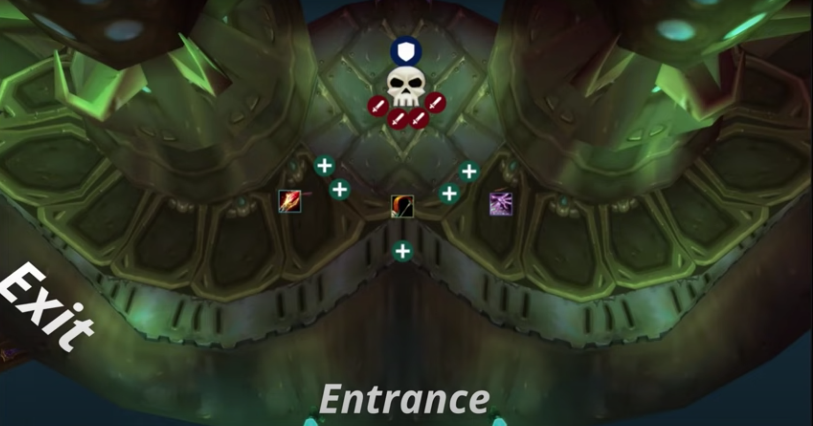
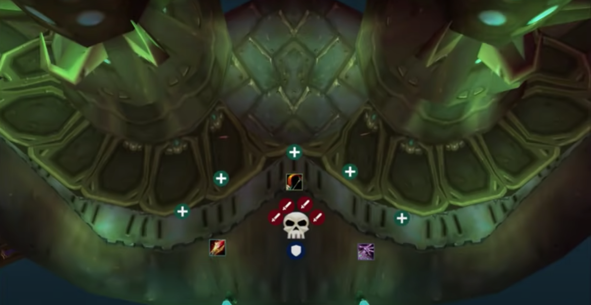
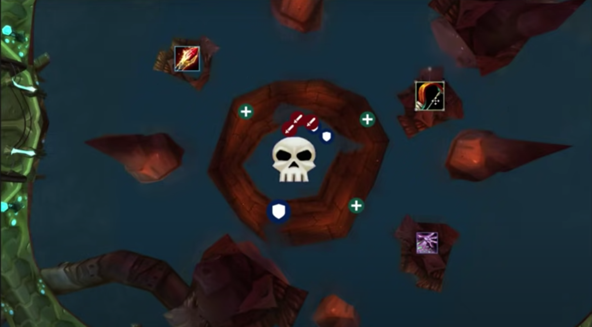
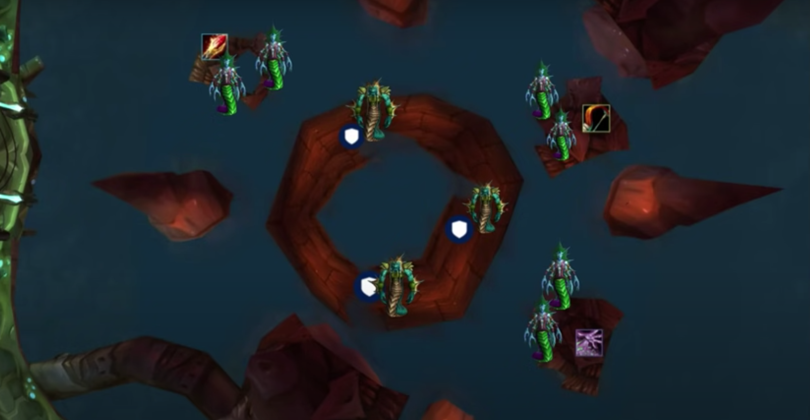

# Bloodbaine and **you** in phase two
---

A quick note to start with: during progression we will try to stick to our 3 hour schedules. We will progress with a focused mindset, but ultimately we are here to have fun as a team. Enjoy these new and exciting raids we are about to face.

Besides that, this document is in case you are new to SSC and you want a good idea of what you are getting in to. If you have a good idea of what is going on and just want a quick view of the assignments [**here**]() you go.

## Group setup

Before each raid, the table below will be updated to reflect the group composition of that day. I will use strictly character names so new guild members aren't left in the dark. Each entry in the table receives a number which will be used for assignments. This is to increase reusability of the sheet and to avoid confusion.

| Tanks | Healers | Melee | Ranged |
| ----------- | ----------- | ----------- | ----------- |
| 1: Tomorrowland   | 4: Raemar         | 9: Djretmasterx   | 14: Nazzo |
| 2: Lieven         | 5: Naarii         | 10: Zyepox        | 15: Hayfa |
| 3: Khyrdan        | 6: Talyra         | 11: Kritzo        | 16: Dragma |
|                   | 7: Adeptus        | 12: Snowbolls     | 17: Lepotan |
|                   | 8: Eiswuerfel     | 13: Shamidon      | 18: Capernian |
|                   |                   |                   | 19: Ex |
|                   |                   |                   | 20: Brunarian |
|                   |                   |                   | 21: Onlytwogendr |
|                   |                   |                   | 22: Galing |
|                   |                   |                   | 23: Marionette |
|                   |                   |                   | 24: Agaboo |
|                   |                   |                   | 25: Samlad |

## Serpentshrine Cavern
---

### Trash leading up to **Hydross the Unstable**

Before we can beat the mighty first boss of SSC, we need to clear trash. This trash does require some paying attention to. There are a few types of packs before the first boss.

**FIRST TYPE OF PACK**

[**Coilfang Hate-Screamer**](https://tbc.wowhead.com/npc=21339/coilfang-hate-screamer)
- Immune to CC
- AOE silence 30 yards around herself
- Arcane blasts nearby enemies
- Moderate melee damage

[**Serpentshrine Sporebat**](https://tbc.wowhead.com/npc=21246/serpentshrine-sporebat)
- Vulnerable to CC
- Charges furthest target for moderate melee damage
- Coilfang Beast-Tamers can enrage them, making them immune to CC

[**Serpentshrine Beast-Tamer**](https://tbc.wowhead.com/npc=21221/coilfang-beast-tamer)
- Immune to CC
- Cleaves
- Can enrage Serpentshrine Sporebats, making them immune to CC

> Kill Beast-Tamers >> CC Sporebats >> Kill Hate-Screamers >> Kill Sporebats

**SECOND TYPE OF PACK**

[**Underbog Colossus**](https://tbc.wowhead.com/npc=21221/coilfang-beast-tamer)

These are like the father of the ones in Steamvaults. Nature resistance helps a lot on these. They are also similar to the Anubisath Sentinels or the Core Hounds. They spawn with random abilities that are unique to them.

- *Type A*: does a [**Spore Quake**](https://tbc.wowhead.com/spell=38976/spore-quake). Shit's nasty. 2,000 damage per tick and a chance to knock down. Melee need to get to at least 30 yards away.
- *Type B*: 
    - does an [**Acid Geyser**](https://tbc.wowhead.com/spell=41573/acid-geyser). Works exactly the same as the Netherspite breath. Everyone needs to spread out.
    - Affects players with a DOT which afterwards spawns a little parasite. Kill it, or it reinfects other players.
- *Type C*: these enrage. Hunters need to [**Tranquilizing Shot**](https://tbc.wowhead.com/spell=19801/tranquilizing-shot)

They also have abilities when they die. Notably they can either spawn a load of adds or two big ones. The other abilities I'm sure will speak for themselves. Goblins can herb these giants for a nice profit. [**hehe**](https://external-content.duckduckgo.com/iu/?u=http%3A%2F%2Fcustom-gwent.com%2FcardsBg%2F57086c5f7494678b06d3098c4502ca35.jpeg&f=1&nofb=1)

### **Hydross the Unstable**: "The melee killer"

The fight is split up in two phases. A **Frost** and a **Nature** phase. We will have to manually move the boss from phase to phase to prevent us dying to the **Mark** mechanic. When the boss is moved across the middle he changes to an according phase. **North is the Frost** phase and **South is the Nature** phase. This also triggers a **THREAT WIPE**, which means no damage is supposed to go out during the transition.

The **Mark** mechanic is a specific debuff for either phase that stacks up slowly the longer you are in a phase. This makes it harder to stay in a given phase. We will **swap to either side around 100% of the Mark debuff**.

Below you can find the positioning for the **Frost** phase.

During the **Frost** phase, the boss targets players with [**Water Tomb**](https://tbc.wowhead.com/spell=38235/water-tomb), an AOE stun which deals moderate DOT damage. Everyone needs to be at least 8 yards apart.

Below you can find the positioning for the **Nature** phase.

During the **Nature** phase, the boss puts a [**Vile Sludge**](https://tbc.wowhead.com/spell=38246/vile-sludge) debuff on a random player, reducing their healing taken and doing moderate DOT damage.

Adds will spawn during the **phase transitions** around Hydross. The **third tank (Khyrdan)** is responsible for picking these up. If the tank is overwhelmed, **Warlocks** can help by **Banishing** escaped adds.

### Trash leading up to **The Lurker Below**

This trash is a joke. You can read up on them if you are so inclined. I made all the names clickable. Kill order as follows.

> CC [Greyheart Technicians](https://wowpedia.fandom.com/wiki/Greyheart_Technician) and [Coilfang Priestesses](https://wowpedia.fandom.com/wiki/Coilfang_Priestess) >> Kill [Coilfang Shatterers](https://wowpedia.fandom.com/wiki/Coilfang_Shatterer) >> Kill [Vashj'ir Honor Guard](https://wowpedia.fandom.com/wiki/Vashj%27ir_Honor_Guard) >> Kill [Greyheart Technicians](https://wowpedia.fandom.com/wiki/Greyheart_Technician)

### **The Lurker Below**: Loot Piñata

Any improved [King's Defenderers](https://tbc.wowhead.com/item=30058/mallet-of-the-tides)? First week for sure. This guy is just like Chess Event, in that he will never drop what you want and will bore you to tears.

He swaps between **two phases**. A **Boss** phase and an **Add** phase. 

Below, you can see the positioning for the **Boss** phase.

He does three things in the **Boss** phase. 

- He does a [**Geyser**](https://tbc.wowhead.com/spell=37478/geyser), which acts similar to the [**Water Tomb**](https://tbc.wowhead.com/spell=38235/water-tomb) from **Hydross**. Everyone needs to be 10 yards apart ideally.
- He will straight up [**go Blastoise mode**](https://external-content.duckduckgo.com/iu/?u=https%3A%2F%2Forig00.deviantart.net%2F63e8%2Ff%2F2013%2F104%2F2%2Fc%2Fblastoise_by_youngj723-d61rt01.jpg&f=1&nofb=1) and start squirting water clockwise or counter clockwise (like **C'thun**). You will keep pumping until he's about to turn to you, at which point you jump in the water for safety. ([wowhead link](https://tbc.wowhead.com/spell=37433/spout))
- He does a [**Whirl**](https://tbc.wowhead.com/spell=37363/whirl) which is a melee only mechanic. Tanks will take care of this with a gap closer so no unfortunate accidents happen.

After two minutes **The Lurker Below** will submerge, starting the **Add** phase.

During this **Add** phase, **adds** spawn (who would've thought). Each small platform spawns two [**Coilfang Ambushers**](https://tbc.wowhead.com/npc=21865/coilfang-ambusher). These **will be CC'ed by the ranged DPS on the platform** until the [**Coilfang Guardians**](https://tbc.wowhead.com/npc=21873/coilfang-guardian) are dead. These Guardians will be tanked and focused down, after which melee and casters will go around in a clockwise fashion to kill the Ambushers. 

After the **adds** are dead, **The Lurker Below** will reemerge and do a wombocombo, so prepare for that.

> Whirl >> Spout >> Whirl

After this it's rinse and repeat boys and girls. Time to collect that mace.

